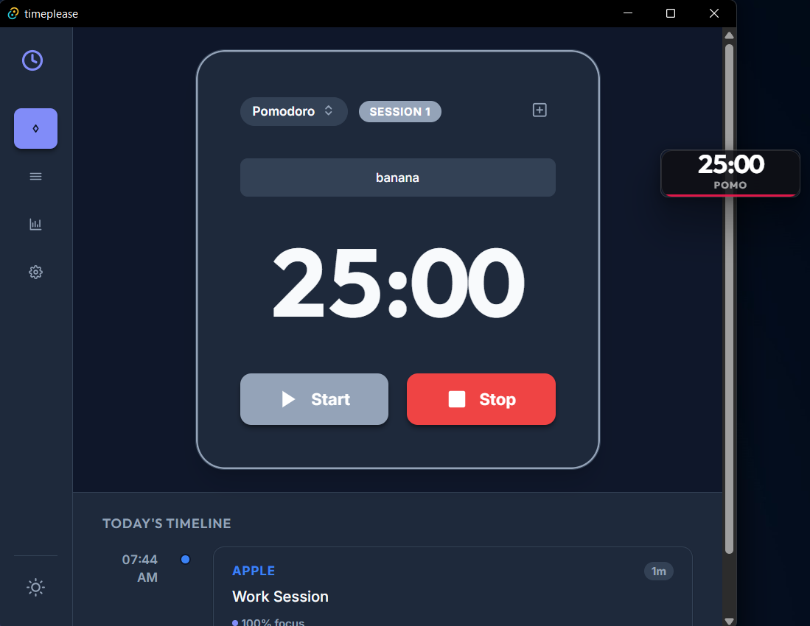

# TimePlease

> **Disclaimer**
>
> This project was mostly built with the help of AI.
> That being said, I did review it line by line, understand how it works, and actively use it myself. 
> I’ve also intentionally kept all logic in UI (Svelte), no custom Rust changes, so Tauri handles the system-level stuff.


TimePlease is a lightweight time-tracking app I built for myself.

It’s not trying to optimize you, motivate you, or convince you you’re productive.  
It just tracks time, and then asks you to be honest about how that time actually went.


---

## What it does

### Two tracking modes

**Pomodoro**
- Default 25 / 5 / 15 setup (configurable)

**Free Flow**
- Simple count-up timer
- Manual start / stop

---

### Honesty check

After every session, it asks:

*“How many minutes did you actually work?”*

- Defaults to elapsed time
- You can reduce it (because distractions happen)
- Optional label for what you worked on

All stats are based on this number, not the raw timer.

---

### Projects

- Create projects with names and colors
- Add notes per project
- Archive projects without losing history

No tasks. No workflows. Just grouping.

---

### Floating HUD

- Always-on-top mini timer
- Draggable
- Color-coded by project
- Can be turned off

---

### Basic stats

- Daily timeline of sessions
- Time breakdown by project
- Efficiency: actual work vs elapsed time
- Break count
- Full session history

---

### Notifications

- Desktop notifications for Pomodoro transitions
- Configurable reminders for Free Flow

---


## Technology Stack

- **Frontend**: Svelte 5 + TypeScript + Vite
- **Desktop Framework**: Tauri 2
- **Data Storage**: JSON-based local storage
  - `projects.json`: Project metadata
  - `sessions.json`: Work history
  - `daily_stats.json`: Daily aggregates
  - `settings.json`: User preferences

- I might do a cloud sync feature in the future.

## Installation & Setup

### Prerequisites

- Node.js (v16 or higher)
- Rust (for Tauri)

### Development

1. Clone the repository:
   ```bash
   git clone <repository-url>
   cd timeplease
   ```

2. Install dependencies:
   ```bash
   npm install
   ```

3. Run in development mode:
   ```bash
   npm run tauri dev
   ```

### Building for Production

Build the application for your platform:

```bash
npm run tauri build
```

The compiled application will be available in `src-tauri/target/release`.

## Usage

1. **Create a Project**: Start by creating a project to categorize your work
2. **Select Tracking Mode**: Choose between Pomodoro or Free Flow mode
3. **Start Timer**: Begin tracking your focused work time
4. **Complete Session**: When finished, answer the honesty check
5. **Review Metrics**: Check your productivity stats and session history

## Screenshot



## What TimePlease is NOT

- ❌ **Not a Task Manager**: No to-do lists or task tracking
- ❌ **Not a Calendar**: No scheduling features
- ❌ **Not a Team Tool**: Designed for single-user focus

If you need these features, I would highly recommend super-productivity.


## Contributing

Suggestions / pull requests / bug reports / feedback welcome!
